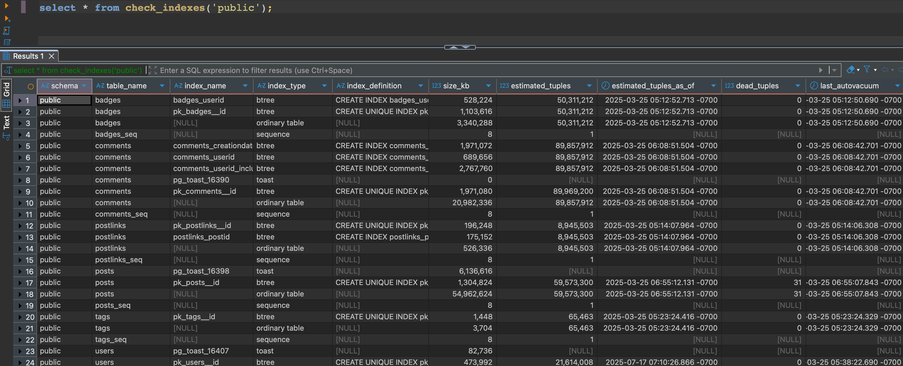

<!-- Improved compatibility of back to top link: See: https://github.com/othneildrew/Best-README-Template/pull/73 -->

<!-- PROJECT SHIELDS -->
<!--
*** I'm using markdown "reference style" links for readability.
*** Reference links are enclosed in brackets [ ] instead of parentheses ( ).
*** See the bottom of this document for the declaration of the reference variables
*** for contributors-url, forks-url, etc. This is an optional, concise syntax you may use.
*** https://www.markdownguide.org/basic-syntax/#reference-style-links
-->
[![Contributors][contributors-shield]][contributors-url]
[![Forks][forks-shield]][forks-url]
[![Stargazers][stars-shield]][stars-url]
[![Issues][issues-shield]][issues-url]
[![MIT License][license-shield]][license-url]
[![LinkedIn][linkedin-shield]][linkedin-url]

<h3 align="center">Smart Postgres Box of Tricks</h3>

  

    Utility scripts to make PostgreSQL performance tuning easier. 
    Brought to you by the folks at <a href="https://SmartPostgres.com">SmartPostgres.com</a>.
     
    <a href="https://github.com/SmartPostgres/Box-of-Tricks/issues/new?assignees=&labels=bug&projects=&template=bug_report.md&title=">Report Bug</a>
    ·
    <a href="https://github.com/SmartPostgres/Box-of-Tricks/issues/new?assignees=&labels=&projects=&template=feature_request.md&title=">Contribute Code for a Feature</a>
  

<!-- TABLE OF CONTENTS -->

  
Table of Contents

  <ol>
    <li><a href="#getting-started">Getting Started</a></li>
    <li><a href="#prerequisites">Prerequisites</a></li>
    <li><a href="#usage">Usage</a></li>
    <li><a href="#contributing">Contributing</a></li>
    <li><a href="#license">License</a></li>
    <li><a href="#contact">Contact</a></li>
  </ol>

<!-- GETTING STARTED -->
## Getting Started

Click Releases at the top of this page to download the installation file, which contains each of the sql scripts.

Our target audience is folks who already know how to create and query Postgres functions. If you don't fall into that audience, we're not quite ready for you yet, but at some point in the future we'll have more detailed instructions for folks who are completely new to Postgres.

### Prerequisites

The Box of Tricks works with all currently supported versions of Postgres (as of this writing, going back to v12), plus Amazon RDS Aurora PostgreSQL. Other proprietary cloud brands of Postgres may also work, we just haven't tested 'em. If you run into problems on other versions, we only take bug reports that also include a pull request to make the necessary changes. Otherwise, we just can't test the Box of Tricks on every possible cloud platform.

(<a href="#readme-top">back to top</a>)

<!-- USAGE EXAMPLES -->
## Usage

### check_indexes

This function analyzes the health and design of your indexes.

Parameters include:

<ul>
  <li>v_schema_name - default null (all schemas)</li>
  <li>v_table_name - default null (all tables)</li>
  <li>v_warning_format - default 'rows', which means each warning gets its own row. That's the only supported output format for now, but in the future we'll add a way to support multiple warnings in a single row.</li>
  <li>v_debug_level - default 0 (no debug output), can also be 1 (minimal debug output) or 2 (detailed debug output with dynamic SQL).</li>
</ul>

To check the health and design of all of the tables & indexes in your database, run:

<pre>select * from check_indexes(null, null);</pre>

Those first two parameters are schema name and table name. If you want to check all of the objects in a particular schema, run:

<pre>select * from check_indexes('my_schema_name', null)</pre>

Or to check a single table:

<pre>select * from check_indexes('my_schema_name', 'my_table_name')</pre>

Output columns include (skipping the ob)

<ul>
  <li>schema_name</li>
  <li>table_name</li>
  <li>index_name</li>
  <li>index_type - btree, ordinary table, sequence, toast, etc.</li>
  <li>index_definition - the create statement to reproduce it, useful if you need to put objects into source control or recreate them in other environments</li>
  <li>size_kb</li>
  <li>estimated_tuples</li>
  <li>estimated_tuples_as_of - date</li>
  <li>dead_tuples</li>
  <li>last_autovacuum - date</li>
  <li>last_manual_nonfull_vacuum_ - date</li>
  <li>fill_factor</li>
  <li>is_unique</li>
  <li>is_primary</li>
  <li>table_oid</li>
  <li>index_oid</li>
  <li>priority - if we return a warning about a problem with this object, like autovacuum not keeping up, then the most urgent priorities (like 1) go first, and lower priorities are sorted lower (like 200)</li>
  <li>warning_summary</li>
  <li>warning_details</li>
  <li>url - if we return a warning, you can copy-paste the URL into your browser to learn more about it</li>
  <li>reloptions</li>
  <li>drop_object_command - useful if you want to drop specific objects</li>
</ul>

(<a href="#readme-top">back to top</a>)

### drop_indexes

This function does what it says on the label. It's useful for training class attendees who want to reset a table to its base state before doing index tuning.

Parameters include:

<ul>
  <li>v_schema_name - default null (all schemas), or you can pass in a single schema to focus on just one.</li>
  <li>v_table_name - default null (all tables), or you can pass in a single schema to focus on just one.</li>
  <li>v_drop_primary_keys, v_force_drop_with_constraints, v_drop_concurrently - all boolean options that default to false.</li>
  <li>v_list_indexes_being_dropped - useful if you want confirmation that work was actually done.</li>
  <li>v_print_drops_but_dont_execute - default false, but set it to true if you want to do a dry run to see what it will delete.</li>
</ul>

<!-- CONTRIBUTING -->
## Contributing

Contributions are what make the open source community such an amazing place to learn, inspire, and create. Any contributions you make are **greatly appreciated**.

If you have a suggestion that would make this better, please fork the repo and create a pull request as described in our [Contributing Guide](https://github.com/SmartPostgres/Box-of-Tricks/blob/dev/CONTRIBUTING.md).

(<a href="#readme-top">back to top</a>)

### Top contributors:

<!-- LICENSE -->
## License

Distributed under the MIT License. [See the LICENSE file for more information.](https://github.com/SmartPostgres/Box-of-Tricks/blob/dev/LICENSE)

(<a href="#readme-top">back to top</a>)

<!-- CONTACT -->
## Contact

Brent Ozar - humans@smartpostgres.com

Project Link: [https://github.com/SmartPostgres/Box-of-Tricks](https://github.com/SmartPostgres/Box-of-Tricks)

(<a href="#readme-top">back to top</a>)

<!-- MARKDOWN LINKS & IMAGES -->
<!-- https://www.markdownguide.org/basic-syntax/#reference-style-links -->
[contributors-shield]: https://img.shields.io/github/contributors/SmartPostgres/Box-of-Tricks.svg?style=for-the-badge
[contributors-url]: https://github.com/SmartPostgres/Box-of-Tricks/graphs/contributors
[forks-shield]: https://img.shields.io/github/forks/SmartPostgres/Box-of-Tricks.svg?style=for-the-badge
[forks-url]: https://github.com/SmartPostgres/Box-of-Tricks/network/members
[stars-shield]: https://img.shields.io/github/stars/SmartPostgres/Box-of-Tricks.svg?style=for-the-badge
[stars-url]: https://github.com/SmartPostgres/Box-of-Tricks/stargazers
[issues-shield]: https://img.shields.io/github/issues/SmartPostgres/Box-of-Tricks.svg?style=for-the-badge
[issues-url]: https://github.com/SmartPostgres/Box-of-Tricks/issues
[license-shield]: https://img.shields.io/github/license/SmartPostgres/Box-of-Tricks.svg?style=for-the-badge
[license-url]: https://github.com/SmartPostgres/Box-of-Tricks/blob/master/LICENSE.txt
[linkedin-shield]: https://img.shields.io/badge/-LinkedIn-black.svg?style=for-the-badge&logo=linkedin&colorB=555
[linkedin-url]: https://linkedin.com/in/brentozar
